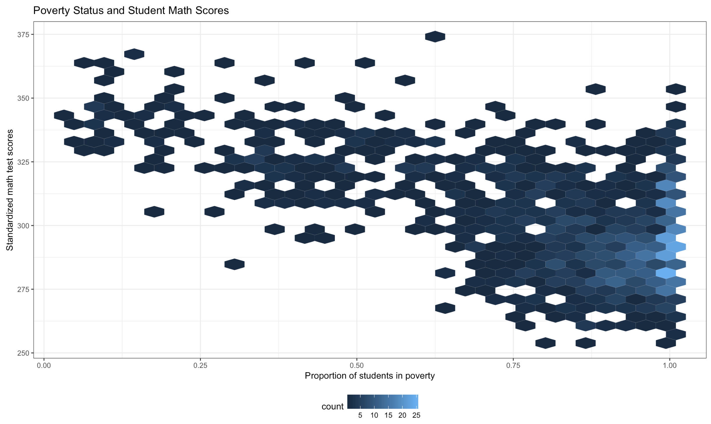

 
Since lead is a known neurotoxicant with longterm effects in cognition, we ran an explorative analysis to test wether there was an association between low test scores and high proportion of highly lead contaminated pipes. Overall there is not association; however, there is an association between lower test scores and poverty and schools that are predominatly hispanic and black. Interestenly, as we show in the home page, schools with high rates of poverty are also associated with higher proportion of lead contaminated pipes.

**Poverty and Standardized Test Scores**

Figure 5. shows the standardized test scores distributions by the proportion of students in poverty. As the proportion of students in poverty increases, standardized math test scores decrease.

  

**Race and Standardized Test Scores**

**Figure 4.** shows the standardized test scores distributions for each racial/ethnic group. For this, schools were grouped based on the racial/ethnic category with the largest percentage of students in a given school. Comparing figure 4 to figure 3, we see that even though the proportion of highly contaminated lead pipes across schools is similar, except for those schools with a  majority of black students, the test scores are much lower in those schools that have a majority of hispanic or african students.  

  