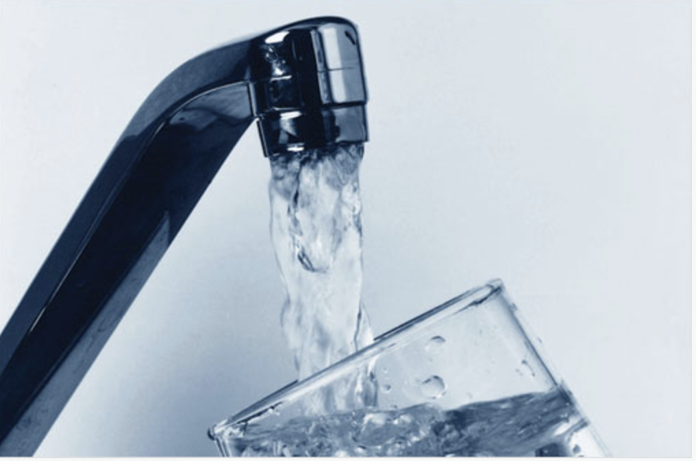

### Lead exposure through water outlets in New York City Public schools.
 

 

An issue that affects the lives of individuals globally, even within developed countries like the United States, is a lack of access to clean drinking water. Contaminants such as lead are not always visible to the eye and can be deleterious to health especially to susceptible populations like that of children. Although schools should guarantee children safe access to drinking water, recent evaluations have found schools throughout the US to have high levels of lead beyond the set threshold of 15 parts per billion (ppb). It is now well known that exposure to lead, even in low levels, has long lasting effects on neurodevelopment and cognition with an even greater effect when exposure occurs at an early age. Additionally, studies have show that disavantaged populations, such as minorities or those living under the poperty levels, are disproportionately affected by lead exposure. 

New York city is known for its long war in lead poisoning, but up to now there still geographical packets in the city where children test high blood lead levels. Thus, we decided to run an explorative analysis to evaluate the quality of water in New York City public middle and elementary schools, and to determining whether schools with mostlly low income students or those that have a majority of minority students tend to be the most affected by lead water contamination.   

This is what we found:
 
**Figure 1.** shows the proportion of pipes that contain lead measurements above 15 ppb within a school based on the poverty status of the students. Even though it is not statistically significant, we see a pattern of increase number of pipes containing high levels of lead among those schools with higher proportion of students below the poverty level. 

 