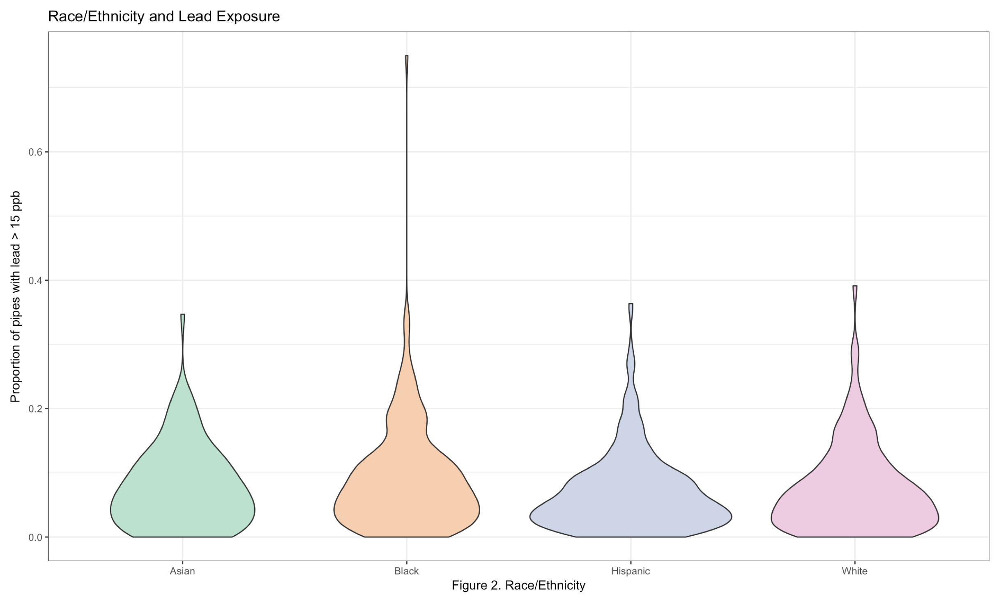

 

 

###Our motivation:
An issue that affects the lives of individuals globally, even within developed countries like the United States, is a lack of access to clean drinking water. Contaminants such as lead are not always visible to the eye and can be deleterious to health especially to susceptible populations like that of children. Although schools should guarantee children safe access to drinking water, recent evaluations have found schools throughout the US to have high levels of lead beyond the set threshold of 15 parts per billion (ppb). Additionally, studies have show that disavantaged populations, such as minorities or those living under the poperty levels, are disproportionately affected by lead exposure. 

New York city is known for its long war in lead poisoning, but up to now there still are geographical packets within the city where children lead blood levels surpass the 5ug/dl threshold. Thus, we decided to run an explorative analysis to evaluate the quality of water in New York City public middle and high schools. Our goal was to determine whether schools with a majority of low income or minority students tend to be the most affected by lead water contamination.   

Since, it is well known that exposure to even low levels of lead has long lasting effects on cognition, we also assesst whether the level of lead water contamination in a given school affects the overall schools performance in the math standarized test.

###Our data sources:
All data was retrieved from the [Health Data NY Open Access Website](https://health.data.ny.gov/) or [NYC Open Data](https://opendata.cityofnewyork.us/) API's. For a detail description of the datasets we use visit the data tab in the top of the website.  

###What we found:

**Lead and Poverty**
 
Figure 1. shows the proportion of pipes that contain lead measurements above 15 ppb within a school based on the poverty status of the students. Even though it is not statistically significant, we see a pattern of increase number of pipes containing high levels of lead among those schools with higher proportion of students below the poverty level. 

  

####
**Lead and Minority Status**
 
Figure 2. shows the distribution for the proportion of pipes containing lead levels above 15 ppb based on the racial/ethnic majority of the school. The distribution is similar among schools where the majority of students are Asian, Hispanic, or White; however, schools with mainly black students have a distribution with higher proportion of pipes containing lead levels above 15 ppb.

  

###Discussion:
 
Based on our exploratory analysis, we found no association between poverty and lead exposure or between lead exposure and test scores. Notably, schools with more black students had, on average, higher proportions of highly contaminated pipes relative to the other races (with white as the reference group). We further observed that those schools with black or Hispanic majorities and schools with increased poverty measures had lower test scores. As environmental justice issues are intrinsically tied to social justice issues, we see minority children in NYC more likely to grow up in poverty, exposed to preventable toxins while at school, and denied the educational oppotunities that they need to thrive.

###Extras:

* If interested on reviewing the graphs for the exploratory analysis covering proportion of contaminated water outlets and test scores, visit the exploratory graphs tap in the upper right corner of this webpage. 
 
* If interested on spacially located those schools with high proportion of lead contaminated pipes (>15ppb), please visit our interactive shinyapp tab in the upper right corner of this website. 
 
* If interested in taking a closer look in our data analysis, please visit our github repository [here](https://github.com/lizzyagibson/p8105_final_project).